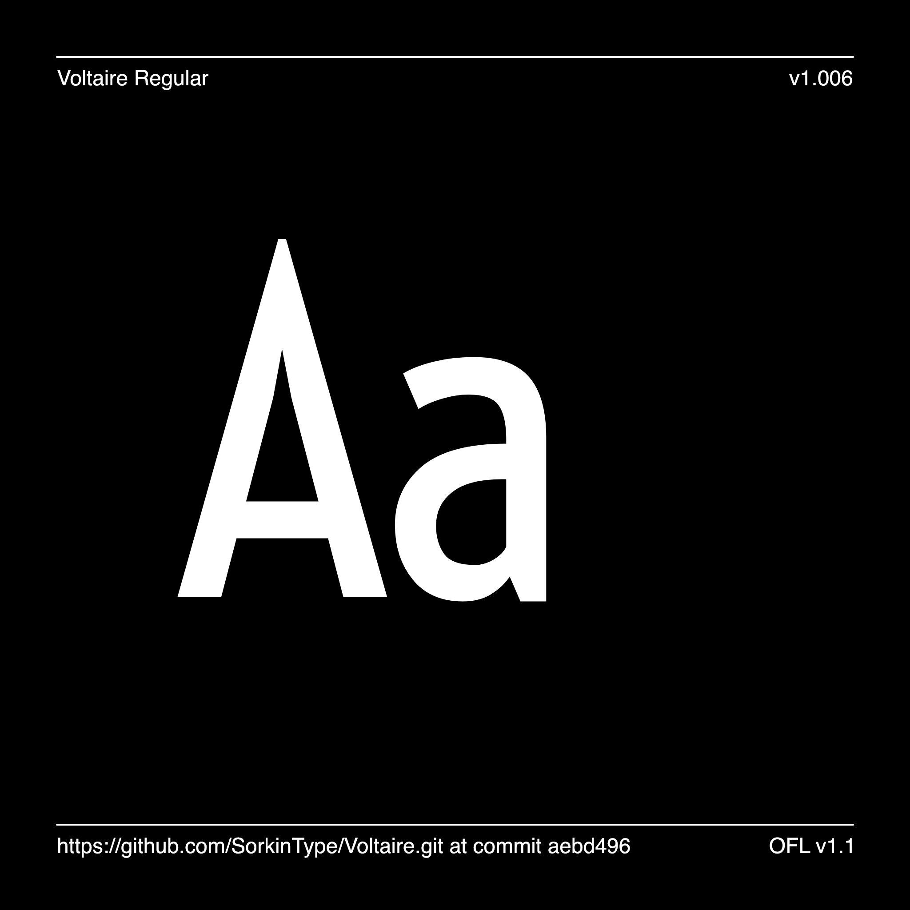
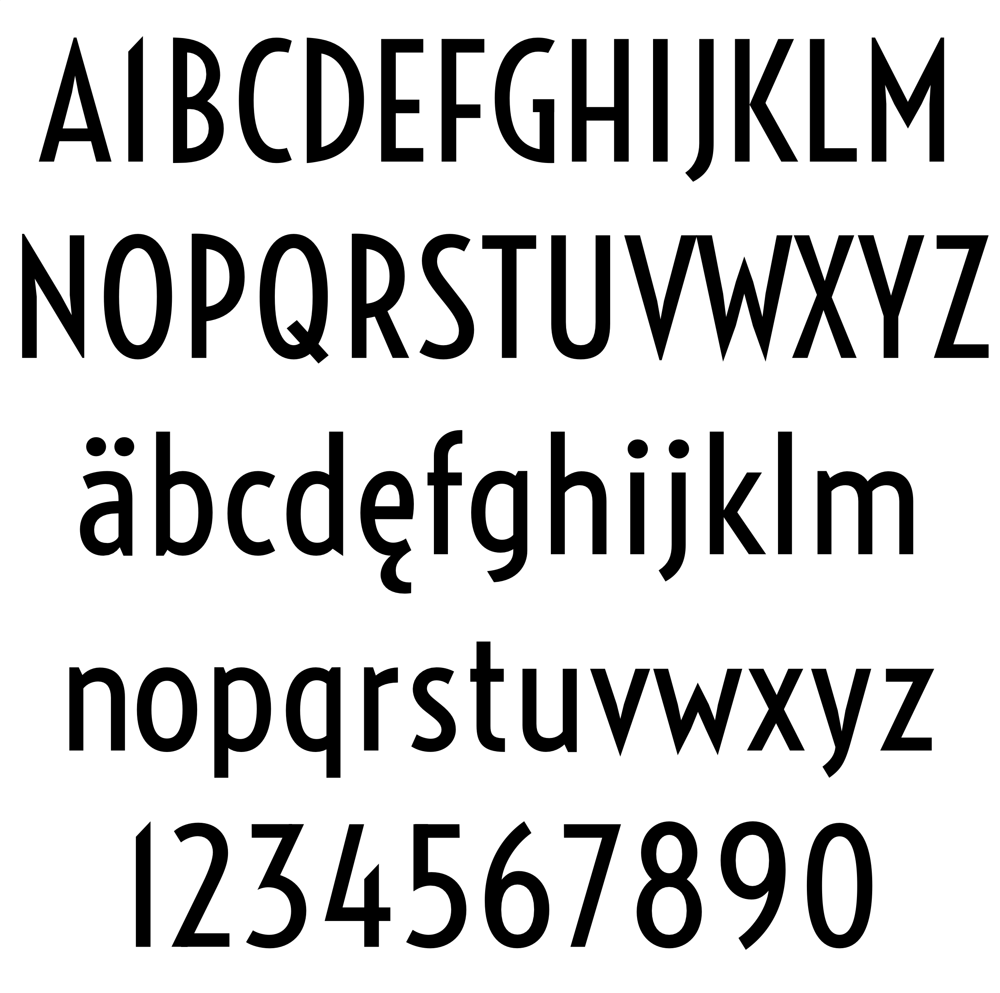

# Voltaire

[![][Fontbakery]](https://SorkinType.github.io/Voltaire/fontbakery/fontbakery-report.html)
[![][Universal]](https://SorkinType.github.io/Voltaire/fontbakery/fontbakery-report.html)
[![][GF Profile]](https://SorkinType.github.io/Voltaire/fontbakery/fontbakery-report.html)
[![][Outline Correctness]](https://SorkinType.github.io/Voltaire/fontbakery/fontbakery-report.html)
[![][Shaping]](https://SorkinType.github.io/Voltaire/fontbakery/fontbakery-report.html)

[Fontbakery]: https://img.shields.io/endpoint?url=https%3A%2F%2Fraw.githubusercontent.com%2FSorkinType%2FVoltaire%2Fgh-pages%2Fbadges%2Foverall.json
[GF Profile]: https://img.shields.io/endpoint?url=https%3A%2F%2Fraw.githubusercontent.com%2FSorkinType%2FVoltaire%2Fgh-pages%2Fbadges%2FGoogleFonts.json
[Outline Correctness]: https://img.shields.io/endpoint?url=https%3A%2F%2Fraw.githubusercontent.com%2FSorkinType%2FVoltaire%2Fgh-pages%2Fbadges%2FOutlineCorrectnessChecks.json
[Shaping]: https://img.shields.io/endpoint?url=https%3A%2F%2Fraw.githubusercontent.com%2FSorkinType%2FVoltaire%2Fgh-pages%2Fbadges%2FShapingChecks.json
[Universal]: https://img.shields.io/endpoint?url=https%3A%2F%2Fraw.githubusercontent.com%2FSorkinType%2FVoltaire%2Fgh-pages%2Fbadges%2FUniversal.json

Voltaire is a low-contrast condensed semi-geometric style sans-serif. Voltaire is highly readable and will work from medium text sizes all the way up to larger display settings. Voltaire was inspired by 20th century Swedish posters whose letters have similar forms.

## About

Yvonne Schüttler designed Voltaire.

Eben Sorkin from Sorkin Type Co. art directed, kerned and added languages to Voltaire. 

## Building

Fonts are built automatically by GitHub Actions - take a look in the "Actions" tab for the latest build.

If you want to build fonts manually on your own computer:

* `make build` will produce font files.
* `make test` will run [FontBakery](https://github.com/googlefonts/fontbakery)'s quality assurance tests.
* `make proof` will generate HTML proof files.

## Changelog

When you update your font (new version or new release), please report all notable changes here, with a date.
[Font Versioning](https://github.com/googlefonts/gf-docs/tree/main/Spec#font-versioning) is based on semver. 

**14 October 2022. Version 1.007**
- Glyphset expanded (from 231 to 711 glyphs)

**27 Nov 2022. Version 1.008**
- Glyphset expanded (from 711 to 831 glyphs)
- Revised Kern-on kerning
- Fixed anchors and diacritic issues
- Added old style numbers and arrows
- Now using Glyphs 3 format source
- Corrected design inconsistencies and improved rendering via TTFA with double point on glyphs with pointy shapes like A V W v w and so on. 
- Now with 330 languages of Latin script

**Update 1.009**
- Glyphset exapanded
- Additional kerning
- Some extra symbols and spaces

353 languages of Latin script:
------------------------------
Abua, Acheron, Achinese, Acholi, Achuar-Shiwiar, Adamawa Fulfulde, Afar, Afrikaans, Aguaruna, Alekano, Aleut, Amahuaca, Amarakaeri, Amis, Anaang, Andaandi, Dongolawi, Anuta, Ao Naga, Apinayé, Aragonese, Arbëreshë Albanian, Arvanitika Albanian, Asháninka, Ashéninka Perené, Asturian, Asu (Tanzania), Atayal, Bagirmi Fulfulde, Balante-Ganja, Balinese, Balkan Romani, Bari, Basque, Bassari, Batak Dairi, Batak Karo, Batak Mandailing, Batak Simalungun, Batak Toba, Bemba (Zambia), Bena (Tanzania), Biali, Bikol, Bini, Bislama, Borana-Arsi-Guji Oromo, Borgu Fulfulde, Bosnian, Breton, Buginese, Bushi, Candoshi-Shapra, Caquinte, Caribbean Hindustani, Cashibo-Cacataibo, Cashinahua, Catalan, Cebuano, Central Aymara, Central Kurdish, Central Nahuatl, Central-Eastern Niger Fulfulde, Chachi, Chamorro, Chavacano, Chiga, Chiltepec Chinantec, Chokwe, Chuukese, Cimbrian, Cofán, Congo Swahili, Cook Islands Māori, Cornish, Corsican, Creek, Crimean Tatar, Croatian, Czech, Danish, Dehu, Dimli, Dutch, Eastern Arrernte, Eastern Oromo, Efik, Embu, English, Ese Ejja, Falam Chin, Faroese, Fijian, Filipino, Finnish, French, Friulian, Gagauz, Galician, Ganda, Garifuna, Ga’anda, German, Gheg Albanian, Gilbertese, Gooniyandi, Gourmanchéma, Guadeloupean Creole French, Gusii, Gwichʼin, Haitian, Hakha Chin, Hani, Hiligaynon, Ho-Chunk, Hopi, Huastec, Hungarian, Hän, Ibibio, Icelandic, Igbo, Iloko, Inari Sami, Indonesian, Irish, Istro Romanian, Italian, Ixcatlán Mazatec, Jamaican Creole English, Japanese, Javanese, Jola-Fonyi, K'iche', Kabuverdianu, Kaingang, Kala Lagaw Ya, Kalaallisut, Kalenjin, Kamba (Kenya), Kaonde, Kara-Kalpak, Karelian, Kashubian, Kekchí, Kenzi, Mattokki, Khasi, Kikuyu, Kimbundu, Kinyarwanda, Kirmanjki, Kituba (DRC), Kongo, Konzo, Koyra Chiini Songhay, Koyraboro Senni Songhai, Kuanyama, Kven Finnish, Kölsch, Ladin, Ladino, Latgalian, Ligurian, Lithuanian, Lombard, Low German, Lower Sorbian, Luba-Lulua, Lule Sami, Luo (Kenya and Tanzania), Luxembourgish, Maasina Fulfulde, Macedo-Romanian, Madurese, Makhuwa, Makhuwa-Meetto, Makonde, Makwe, Malagasy, Malaysian, Maltese, Mam, Mandinka, Mandjak, Mankanya, Manx, Maore Comorian, Maori, Mapudungun, Marshallese, Matsés, Mauritian Creole, Megleno Romanian, Meriam Mir, Meru, Mezquital Otomi, Minangkabau, Mirandese, Mizo, Mohawk, Montenegrin, Mundang, Munsee, Murrinh-Patha, Mwani, Ménik, Mískito, Naga Pidgin, Ndonga, Neapolitan, Ngazidja Comorian, Nigerian Fulfulde, Niuean, Nobiin, Nomatsiguenga, North Ndebele, Northern Kurdish, Northern Qiandong Miao, Northern Sami, Northern Uzbek, Norwegian, Nyanja, Nyankole, Occitan, Ojitlán Chinantec, Orma, Oroqen, Palauan, Paluan, Pampanga, Papantla Totonac, Papiamento, Pedi, Picard, Pichis Ashéninka, Piemontese, Pijin, Pintupi-Luritja, Pipil, Pohnpeian, Polish, Portuguese, Potawatomi, Prussian, Pulaar, Purepecha, Páez, Quechua, Romanian, Romansh, Rotokas, Rundi, Rwa, Saafi-Saafi, Samburu, Samoan, Sango, Sangu (Tanzania), Saramaccan, Sardinian, Scottish Gaelic, Secoya, Sena, Seri, Seselwa Creole French, Shambala, Shawnee, Shipibo-Conibo, Shona, Shuar, Sicilian, Silesian, Slovak, Slovenian, Soga, Somali, Soninke, South Ndebele, Southern Aymara, Southern Qiandong Miao, Southern Sami, Southern Sotho, Spanish, Sranan Tongo, Standard Estonian, Standard Latvian, Standard Malay, Sundanese, Swahili, Swati, Swedish, Swiss German, Tagalog, Tahitian, Taita, Tasawaq, Tedim Chin, Tetum, Tetun Dili, Tiv, Toba, Tojolabal, Tok Pisin, Tokelau, Tonga (Tonga Islands), Tonga (Zambia), Tosk Albanian, Totontepec Mixe, Tsonga, Tswana, Tumbuka, Turkish, Turkmen, Tuvalu, Tzeltal, Tzotzil, Uab Meto, Umbundu, Ume Sami, Upper Guinea Crioulo, Upper Sorbian, Venda, Venetian, Veps, Vietnamese, Vlax Romani, Võro, Walloon, Walser, Wangaaybuwan-Ngiyambaa, Waorani, Waray (Philippines), Warlpiri, Wayuu, Welsh, West Central Oromo, Western Abnaki, Western Frisian, Western Niger Fulfulde, Wik-Mungkan, Wiradjuri, Wolof, Xavánte, Xhosa, Yanesha', Yao, Yapese, Yindjibarndi, Yoruba, Yucateco, Zapotec, Zarma, Zulu, Záparo

353 languages supported in total.

## License

This Font Software is licensed under the SIL Open Font License, Version 1.1.
This license is available with a FAQ at
https://scripts.sil.org/OFL

## Repository Layout

This font repository structure is inspired by [Unified Font Repository v0.3](https://github.com/unified-font-repository/Unified-Font-Repository), modified for the Google Fonts workflow.
